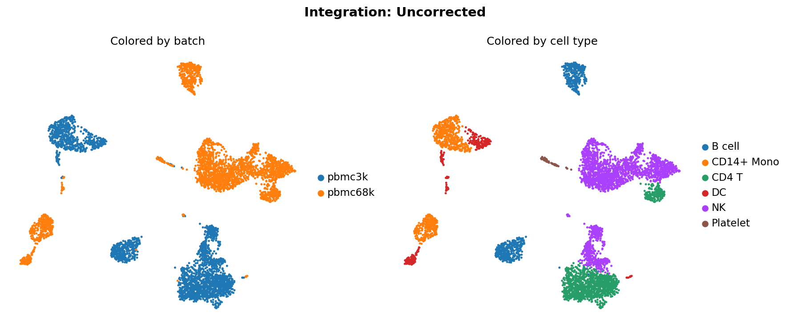
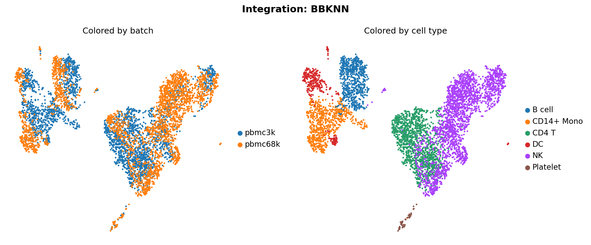
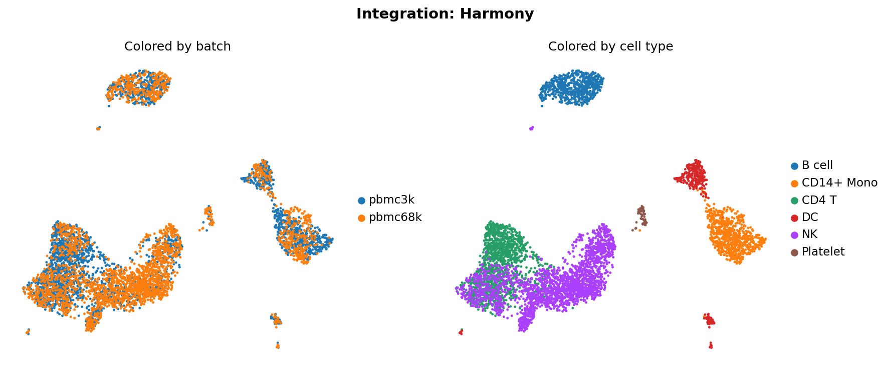
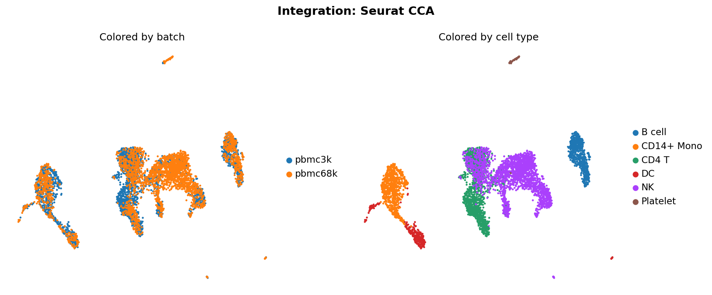
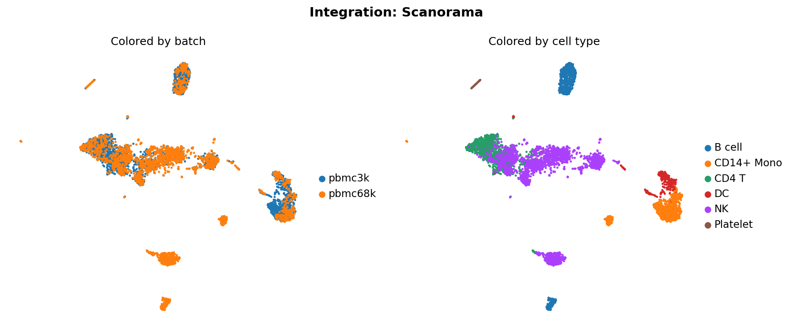
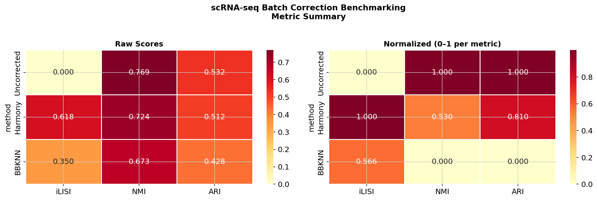

# scRNA-seq Batch Correction Benchmarking Pipeline

A reproducible, modular pipeline for benchmarking single-cell RNA-seq batch correction methods. Applies multiple integration approaches to the same preprocessed dataset and evaluates them using established metrics from the scIB benchmarking framework.

Built as an exploratory benchmarking framework, not a production clinical pipeline.

---

## Motivation

Batch effects are a central challenge in single-cell RNA-seq analysis — technical variation introduced by differences in library preparation, sequencing chemistry, or processing date can obscure genuine biological signal. Multiple correction methods exist, each making different assumptions and tradeoffs between batch mixing and biological conservation. This pipeline makes those tradeoffs explicit and quantifiable.

---

## Dataset

| Batch | Source | Chemistry | Cells |
|-------|--------|-----------|-------|
| PBMC 3k | 10x Genomics | Chromium v1 | ~2,700 |
| PBMC 68k | GEO GSE132044 (Ding et al. 2020, *Nat Biotechnol*) | Chromium v3 | ~3,000 |

Using two PBMC datasets from different 10x Chromium chemistry versions introduces a genuine technical batch effect, making the benchmarking interpretable rather than artificial. Ground truth cell type labels are derived from marker-based annotation (CD14+ Mono, CD4 T, CD8 T, NK, B cell, DC, Platelet).

---

## Methods Benchmarked

| Arm | Method | Correction Level |
|-----|--------|-----------------|
| Baseline | Uncorrected PCA | None |
| A | BBKNN | Graph (neighbor graph correction) |
| B | Harmony | Embedding (PCA correction) |
| C | Seurat CCA | Embedding (anchor-based integration via CCA) |
| D | Scanorama | Embedding (manifold alignment across batches) |

---

## Metrics

Evaluated using [scib-metrics](https://github.com/YosefLab/scib-metrics):

| Metric | Measures | Higher = Better |
|--------|----------|-----------------|
| **iLISI** | Batch mixing — are cells from different batches interleaved in the embedding? | ✓ |
| **NMI** | Biological conservation — do clusters align with known cell type labels? | ✓ |
| **ARI** | Clustering agreement with ground truth cell type assignments | ✓ |

---

## Results

| Method | NMI | ARI | iLISI |
|--------|-----|-----|-------|
| Uncorrected | 0.769 | 0.532 | 0.000 |
| Harmony | 0.724 | 0.513 | 0.618 |
| Seurat CCA | 0.716 | 0.519 | 0.640 |
| BBKNN | 0.673 | 0.428 | 0.350 |
| Scanorama | 0.649 | 0.376 | 0.178 |

All four methods improve batch mixing (iLISI ↑) at a modest cost to biological conservation (NMI/ARI ↓), consistent with the expected correction tradeoff. Seurat CCA achieves the strongest batch mixing (iLISI 0.640) while remaining competitive with Harmony on conservation — consistent with CCA-based methods being aggressive mixers in the Luecken et al. benchmarking study. Harmony offers the best overall conservation/mixing balance. Scanorama's lower scores reflect its operation on PCA embeddings rather than raw expression, which limits realignment aggressiveness for datasets with strong chemistry-driven batch effects. Uncorrected iLISI of 0.000 confirms complete batch separation prior to correction.

> **Implementation note**: Seurat v5 removed the `slot=` argument from `GetAssayData()`, breaking SeuratDisk-based h5ad import. The R integration script was rewritten to use `Matrix::readMM()` for count matrix import, with the Python wrapper exporting raw counts as MTX files prior to the R handoff.

### UMAP Projections

| Uncorrected | BBKNN | Harmony |
|:-----------:|:-----:|:-------:|
|  |  |  |

| Seurat CCA | Scanorama |
|:----------:|:---------:|
|  |  |

### Metric Summary



---

## Pipeline Architecture

```
INPUT DATA (PBMC 3k + PBMC 68k via GEO GSE132044)
   │
   ▼
00_download_data.py       — fetch and stage raw count matrices
   │
   ▼
01_preprocess.py          — QC, normalization, HVG selection, PCA
   │
   ├──────────────┬──────────────┬──────────────┐
   ▼              ▼              ▼              ▼
02a BBKNN    02b Harmony   02c Seurat CCA  02d Scanorama
   │              │              │              │
   └──────────────┴──────────────┴──────────────┘
                  │
                  ▼
           03_benchmark.py       — scIB metrics (iLISI, NMI, ARI)
                  │
                  ▼
           04_visualize.py       — UMAP plots + metric heatmap + HTML report
```

Each integration arm produces a standardized AnnData object (`results/corrected/<method>.h5ad`) containing corrected embeddings, UMAP coordinates, batch labels, and cell type annotations. This output contract keeps arms independent and the benchmarking layer method-agnostic.

---

## Reproducing

```bash
# Create and activate environment
conda env create -f environment.yml
conda activate scrna-bench

# Run full pipeline
bash run_pipeline.sh
```

Individual steps can be re-run in isolation. Completed steps are tracked via `.done` markers and skipped on re-runs unless `--force` is passed.

```bash
bash run_pipeline.sh --force   # re-run all steps
```

**Requirements**: Python 3.10, conda. R + Seurat required only for the Seurat CCA arm (skipped gracefully if unavailable).

---

## Repository Structure

```
├── CLAUDE.md                        # Agentic pipeline context document
├── environment.yml                  # Reproducible conda environment
├── run_pipeline.sh                  # Master pipeline runner
├── scripts/
│   ├── 00_download_data.py
│   ├── 01_preprocess.py
│   ├── 02a_integrate_bbknn.py
│   ├── 02b_integrate_harmony.py
│   ├── 02c_integrate_seurat.R
│   ├── 02c_integrate_seurat_wrap.py
│   ├── 02d_integrate_scanorama.py
│   ├── 03_benchmark.py
│   └── 04_visualize.py
├── results/
│   ├── figures/                     # UMAP plots and metric heatmap
│   └── metrics/scores.csv           # Benchmarking scores
└── report/summary.html              # Auto-generated HTML report
```

---

## Dependencies

- [Scanpy](https://scanpy.readthedocs.io/) — preprocessing and visualization
- [BBKNN](https://github.com/Teichlab/bbknn) — batch balanced KNN
- [harmonypy](https://github.com/slowkow/harmonypy) — Harmony integration
- [Scanorama](https://github.com/brianhie/scanorama) — manifold alignment integration
- [scib-metrics](https://github.com/YosefLab/scib-metrics) — benchmarking metrics
- [Seurat](https://satijalab.org/seurat/) (R, optional) — CCA anchor integration

---

## References

Ding et al. (2020). Systematic comparison of single-cell and single-nucleus RNA-sequencing methods. *Nature Biotechnology*, 38, 737–746.

Hie et al. (2019). Efficient integration of heterogeneous single-cell transcriptomes using Scanorama. *Nature Biotechnology*, 37, 685–691.

Korsunsky et al. (2019). Fast, sensitive and accurate integration of single-cell data with Harmony. *Nature Methods*, 16, 1289–1296.

Luecken et al. (2022). Benchmarking atlas-level data integration in single-cell genomics. *Nature Methods*, 19, 41–50.

Polański et al. (2020). BBKNN: fast batch alignment of single cell transcriptomes. *Bioinformatics*, 36(3), 964–965.

Stuart et al. (2019). Comprehensive integration of single-cell data. *Cell*, 177(7), 1888–1902.

